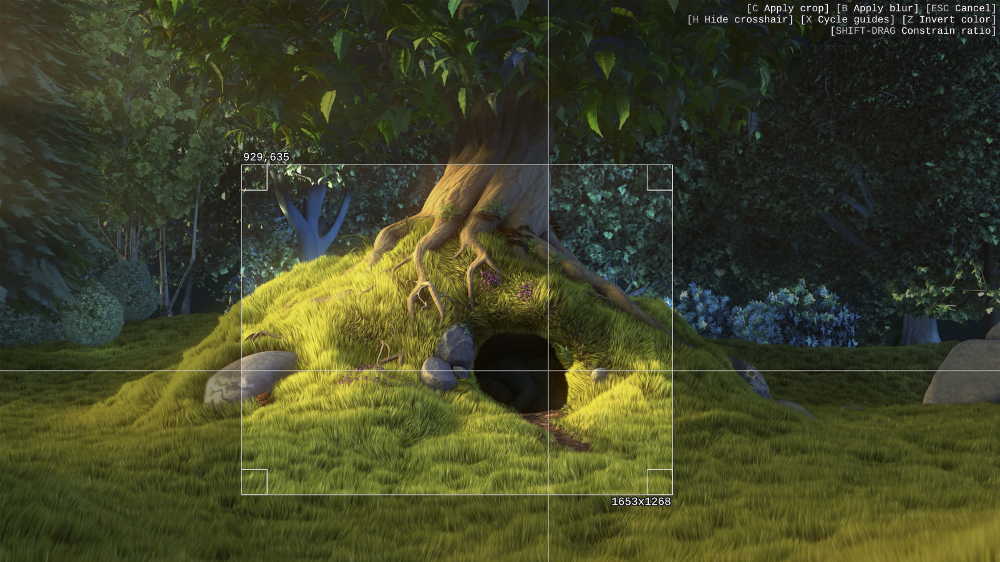

# What is this?

This is a fork of @TheAMM's [mpv_crop_script.lua](https://github.com/TheAMM/mpv_crop_script). Instead of taking cropped screenshots, this version simply crops the video. It also supports obscuring the selected region (blur/delogo) instead of cropping to it.

**Note**: You can still take cropped screenshots using mpv's built-in screenshot functionality.

